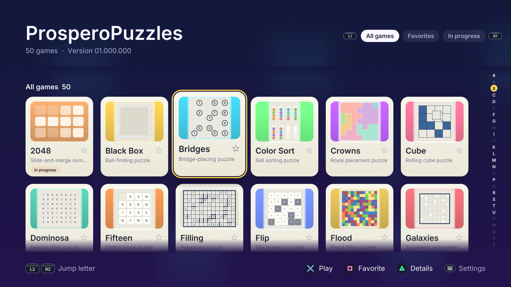

<p align="center">
  
</p>

<h1 align="center">ProsperoPuzzles</h1>

> **Latest release: [01.000.000](https://github.com/blackbearreloaded/ProsperoPuzzles/releases/tag/01.000.000).**
> The first public release: 50 puzzle games, best-score records, sound effects,
> a shuffled soundtrack and home-screen selection music.
> Please report problems through [GitHub issues](https://github.com/blackbearreloaded/ProsperoPuzzles/issues).

<p align="center">
  <strong>A native puzzle collection for PlayStation 5 homebrew</strong><br>
  Fifty polished logic puzzles in one controller-first library, rendered with
  OpenGL 4.6 and built for the DualSense.
</p>

<p align="center">
  
  
  
  
  
  <a href="LICENSE"></a>
</p>

Demo available by clicking the image below.

[](https://i.imgur.com/Q3VpZFS.mp4)

## Highlights

- **50 games in one library:** the 40 puzzles of
  [Simon Tatham's Portable Puzzle Collection](https://www.chiark.greenend.org.uk/~sgtatham/puzzles/),
  **2048**, **Tenfold**, and eight native puzzles: **Color Sort**, **Crowns**,
  **Kakuro**, **Link Up**, **Nurikabe**, **Sokoban**, **Traffic Jam** and
  **Trail**.
- **An A–Z library built for the controller:** favorites pinned first,
  All / Favorites / In progress filters, letter jumps with L2 / R2, and cards
  that show a live preview of each board.
- **One modern skin across every game:** anti-aliased OpenGL 4.6 rendering at
  1080p60, animated transitions and confetti on every solve.
- **Records and progress:** best times and scores per game and size, a gold
  badge on completed games, and games in progress that resume where you left
  them.
- **Sound and music:** 47 sound effects, a soundtrack that plays in a new
  shuffled order at every launch, and looping selection music on the PS5 home
  screen.
- **How to play for everything:** every game has its own rules page, plus
  sizes and difficulties, undo / redo, restart and solve.

> [!IMPORTANT]
> ProsperoPuzzles does not run on an unmodified retail console. It is intended
> for consoles you own with an already configured, compatible homebrew loader.
> This repository does not include an exploit, proprietary Sony SDK, system
> module, encryption key, firmware file, or game asset.

## Project foundation

> [!IMPORTANT]
> **Built on the [PS5 Native App Boilerplate](https://github.com/blackbearreloaded/ps5-native-app-boilerplate).**
> ProsperoPuzzles keeps the template's C++20 structure, reproducible
> clean-room runtime, native FSELF tooling, tests, safe folder deployment and
> release automation.

> [!IMPORTANT]
> **Rendering uses [ps5-opengl](https://github.com/blackbearreloaded/ps5-opengl).**
> The app creates an OpenGL 4.6 Core context through EGL and links the
> ps5-opengl SDK statically. The SDK release is pinned by version and checksum
> in [`tools/fetch-opengl-sdk.sh`](tools/fetch-opengl-sdk.sh); see
> [OpenGL integration](docs/OPENGL_INTEGRATION.md).

| Identity | Value |
| --- | --- |
| Shell title | `ProsperoPuzzles` |
| Title ID | `PPSA99006` |
| Category | Game |
| Current version | `01.000.000` |
| Version source | [`sce_sys/param.json`](sce_sys/param.json) |
| Writable data | `/download0` only |

## Games

| Collection | Games |
| --- | --- |
| Simon Tatham's puzzles | Black Box, Bridges, Cube, Dominosa, Fifteen, Filling, Flip, Flood, Galaxies, Guess, Inertia, Keen, Light Up, Loopy, Magnets, Map, Mines, Mosaic, Net, Netslide, Palisade, Pattern, Pearl, Pegs, Range, Rectangles, Same Game, Signpost, Singles, Sixteen, Slant, Solo, Tents, Towers, Tracks, Twiddle, Undead, Unequal, Unruly, Untangle |
| Native puzzles | Color Sort, Crowns, Kakuro, Link Up, Nurikabe, Sokoban, Traffic Jam, Trail |
| Number games | 2048, Tenfold |

## Current status

Version `01.000.000` has been exercised on PS5 hardware: every game generates
and plays, the library, settings and records persist across relaunches, and the
app presents at a steady 60 FPS with sound effects, music and home-screen
selection music. Broader validation across firmware versions, loaders and TVs
is welcome through [GitHub issues](https://github.com/blackbearreloaded/ProsperoPuzzles/issues).

## Requirements

Build from Linux, WSL, or a Linux CI runner. On Ubuntu, Debian, or WSL:

```bash
sudo apt update
sudo apt install curl git make pkg-config python3 python3-venv tar unzip wget \
  clang-18 clang-format-18 clang-tidy-18 lld-18 ninja-build ccache
make doctor
```

The build downloads and verifies the public PS5 Payload SDK, zlib, GoogleTest,
the ps5-opengl SDK and packaging tools below ignored `.deps/` directories.
Nothing is installed globally by the project build. See
[Getting started](docs/GETTING_STARTED.md) and
[Native tooling](docs/NATIVE_TOOLING.md) for clean-machine setup details.

## Build

```bash
# Production release image; also assembles the complete title folder.
make ffpfsc

# Faster folder-only development build.
make
```

Outputs are written to:

```text
dist/PPSA99006/           complete title folder
dist/PPSA99006.zip        folder archive
dist/PPSA99006.ffpfsc     compressed installation image
```

Useful development gates are:

```bash
make test            # host GoogleTest and integration tests
make lint            # formatting, static analysis, metadata, asset and shell checks
make check           # lint + every host test + complete folder build
make host-snapshots  # render library and game screenshots on the host
make audio-check     # validate sound effects and music
```

## GitHub Actions and releases

The [Build workflow](.github/workflows/tooling.yml) runs on every push to
`main`, pull request, version tag, and manual dispatch. It:

1. installs the public Linux/PS5 build prerequisites;
2. validates the title ID and `contentVersion` in `sce_sys/param.json`;
3. runs lint, GoogleTest and the integration tests;
4. independently reproduces and verifies `runtime/libc.prx`;
5. builds `PPSA99006.ffpfsc` and archives the complete app folder as
   `PPSA99006.zip`; and
6. writes `SHA256SUMS` for both files and uploads all three as the Actions
   artifact.

When a push to `main` carries a `contentVersion` that has no tag yet, the
workflow creates that tag on the tested commit and publishes a GitHub Release
with the `.ffpfsc` image, the app-folder `.zip` and `SHA256SUMS`. Pushes that
keep the same version only build and test.

## Install or update

1. Download either `PPSA99006.ffpfsc` or `PPSA99006.zip` from the latest GitHub
   release and verify it with `SHA256SUMS`.
2. Fully close ProsperoPuzzles.
3. For the image form, place `PPSA99006.ffpfsc` in the directory scanned by
   ShadowMountPlus, replacing any older copy. For the folder form, extract
   `PPSA99006.zip` and upload its complete `PPSA99006` directory to
   `/data/homebrew/`, producing `/data/homebrew/PPSA99006/eboot.bin`. Do not
   upload the ZIP itself.
4. Restart ShadowMountPlus cleanly or restart the PS5, then wait for
   ShadowMountPlus to rediscover the title before launching it.
5. Launch ProsperoPuzzles and confirm the version in the library header or at
   the bottom of Settings.

Keeping the title ID as `PPSA99006` preserves saved games, records and settings
in `/download0`; `/app0` comes from the replacement, while the home-screen
artwork and selection music may stay cached until ShadowMountPlus restarts.

## Deploy

For an already-running PS5 FTP service, stage the development folder with:

```bash
make deploy PS5_HOST=192.168.1.100
```

Fully close ProsperoPuzzles before deploying. The deployer writes only the
current title below `/data/homebrew`, uploads through temporary names, and
publishes `eboot.bin` and `sce_sys/param.json` last. To test the packaged form
instead:

```bash
make deploy PS5_HOST=192.168.1.100 DEPLOY_FORMAT=ffpfsc
```

ProsperoPuzzles never changes PS5 system settings or configures a loader. See
[Deployment](docs/DEPLOYMENT.md) for the development loop and removal.

## Controls

| Input | Library | In a game |
| --- | --- | --- |
| D-pad / left stick | Move between games | Move the cursor (stick: free pointer) |
| Cross | Play or resume | Primary action |
| Square | Toggle favorite | Secondary action |
| Triangle | Game details | Key palette (numbers, letters, colours) |
| Circle | Back | Back |
| L1 / R1 | Change filter | Undo / redo |
| L2 / R2 | Jump to the previous / next letter (wraps) | — |
| Options | Settings | Pause (How to play, new game, size, restart, solve) |

Settings cover music, sound-effect and interface volume, swapping Cross and
Circle, reduced motion, an FPS counter and the display resolution.

## Audio

Sound effects live in `assets/audio/sfx/` and follow the naming in
[PLAN.md Appendix A](PLAN.md#appendix-a-audio-asset-spec-for-your-sound-and-music-production);
`tools/process-sfx.py` trims and levels raw clips.

Background music is a playlist: every song in `assets/audio/music/` plays once,
in an order shuffled at each launch, and the list starts over after the last
song. Music sits at 40% under everything else before the Music slider. Convert
songs from any tool with `tools/prepare-music.sh <folder>` (OGG, 48 kHz,
-18 LUFS). The home-screen selection music is `sce_sys/snd0.at9`, an ATRAC9
loop made with the manual steps in
[ps5-at9-converter](https://github.com/blackbearreloaded/ps5-at9-converter#manual-conversion-recommended).

## Source layout

```text
src/main.cpp            display, input, audio and frame loop
src/app/                shell: library, game and settings screens
src/ui/                 library, details, menus, settings, theme and hints
src/games/              game registry, records and the three game families
src/games/sgt/          Simon Tatham puzzle frontend and modern skin
src/games/kit/          shared scene for the native puzzles
src/gfx/                OpenGL 4.6 batch renderer, fonts and canvases
src/audio/              mixer, sound bank and music playlist
src/core/               input, saves, settings, library and version
src/platform/ps5/       EGL display, DualSense and AudioOut
src/third_party/        vendored Tatham puzzles and stb_vorbis
assets/                 fonts, sound effects and music
sce_sys/                param.json, icon, backgrounds and selection music
host/                   host snapshot renderer
tests/                  GoogleTest and Python host tests
docs/                   architecture, setup, testing and integration notes
```

See [Architecture](docs/ARCHITECTURE.md) for how the pieces fit together.

## Versioning

[`sce_sys/param.json`](sce_sys/param.json) is the only application identity and
release-version source. Its PS5-format `contentVersion` is read at startup and
shown in the library header and Settings, and the release workflow uses it as
the tag and release name. Do not add a `v` prefix.

To publish the next version, raise `contentVersion` (for example to
`01.001.000`), pass the local gates, and push to `main`; GitHub Actions tags and
releases it.

Keep `PPSA99006`, `conceptId` and `contentId` stable for updates to this title.
Changing the title ID creates a separate PS5 application with separate saves.
See [Configuration](docs/CONFIGURATION.md).

## Documentation

| Document | Purpose |
| --- | --- |
| [Changelog](CHANGELOG.md) | Changes in each version |
| [Getting started](docs/GETTING_STARTED.md) | Clean-machine prerequisites and first build |
| [Architecture](docs/ARCHITECTURE.md) | Shell, games, rendering and audio flow |
| [Configuration](docs/CONFIGURATION.md) | Identity, versioning and build variables |
| [OpenGL integration](docs/OPENGL_INTEGRATION.md) | SDK selection and rendering rules |
| [Testing](docs/TESTING.md) | Host test boundaries and commands |
| [Deployment](docs/DEPLOYMENT.md) | Safe folder and image staging |
| [Package formats](docs/FFPKG.md) | Folder, `.ffpkg` and `.ffpfsc` outputs |
| [Troubleshooting](docs/TROUBLESHOOTING.md) | Common build, launch and runtime failures |
| [Platform notes](docs/PLATFORM_NOTES.md) | PS5 filesystem, loader and presentation constraints |
| [Runtime shim](docs/RUNTIME_SHIM.md) | Clean-room `libc.prx` scope and reproduction |
| [Presentation assets](docs/PRESENTATION_ASSETS.md) | Icon, backgrounds and selection audio |
| [Contributing](CONTRIBUTING.md) | Change, test and release requirements |
| [Notices](NOTICE.md) | Dependency, asset and license attribution |

## Credits, third-party software, and licenses

ProsperoPuzzles exists thanks to the maintainers and contributors of:

- [Simon Tatham's Portable Puzzle Collection](https://www.chiark.greenend.org.uk/~sgtatham/puzzles/)
  (MIT) for 40 of the games;
- [ps5-opengl](https://github.com/blackbearreloaded/ps5-opengl), with
  [Mesa](https://mesa3d.org/) and OpenGNM PSBC, for OpenGL 4.6 on PS5;
- [PS5 Native App Boilerplate](https://github.com/blackbearreloaded/ps5-native-app-boilerplate)
  and the [PS5 Payload SDK](https://github.com/ps5-payload-dev/sdk) for the
  reproducible native foundation;
- [Inter](https://github.com/rsms/inter) (SIL Open Font License) for the
  interface font, and [stb](https://github.com/nothings/stb) for music decoding
  and font baking;
- [MkPFS](https://github.com/PSBrew/MkPFS),
  [UFS2Tool](https://github.com/SvenGDK/UFS2Tool), LLVM/Clang, Python, zlib and
  GoogleTest for build, packaging and validation tooling.

The sound effects were generated for this project with ElevenLabs Sound
Effects. The original artwork, soundtrack and selection music are distributed
under the project license. Complete revisions, checksums, copyright notices and
third-party terms are recorded in [NOTICE.md](NOTICE.md).

ProsperoPuzzles is distributed under [GPL-3.0-or-later](LICENSE). PlayStation
and PS5 are trademarks of Sony Interactive Entertainment. ProsperoPuzzles is an
independent homebrew project and is not affiliated with or endorsed by Sony
Interactive Entertainment or Simon Tatham.

This project was developed with assistance from Anthropic's Claude. Project
maintainers reviewed and validated the resulting code, tests, documentation,
dependencies and generated assets.
